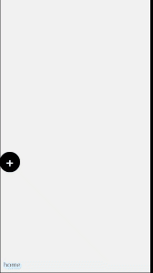

# floating action button


I'm not sure how to call it... but it works as below:  


here is an online demo:  [floating-action-button](https://huamurui.github.io/html-s/#/floating-action-button) 

---

- It's built with web component, you can find how to use it by [index.html](./index.html).
  - bind events
  - custom style & dom
- support PC mouse click and moblie touch.  
- online script:  
    ```html
    <script src="https://huamurui.github.io/fab/fab.js"></script>
    ```

